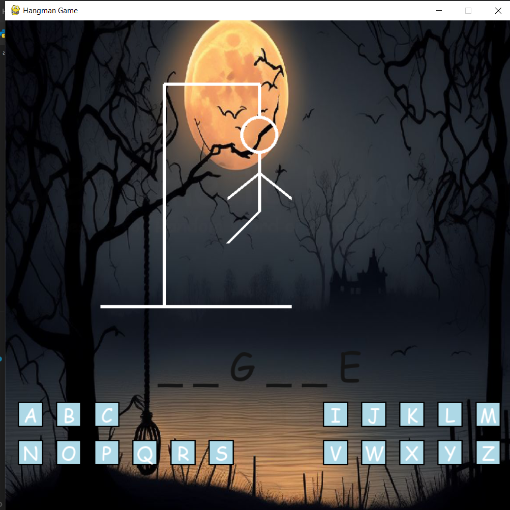
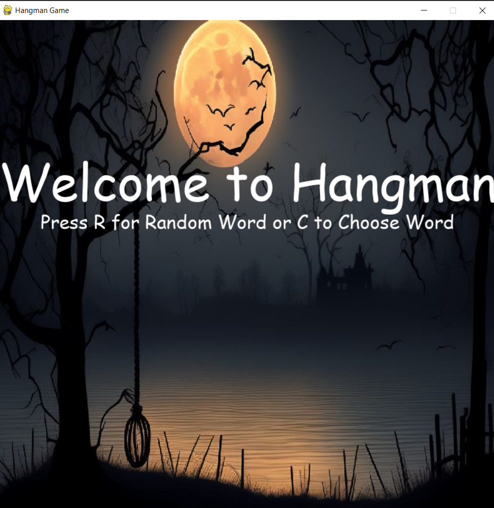
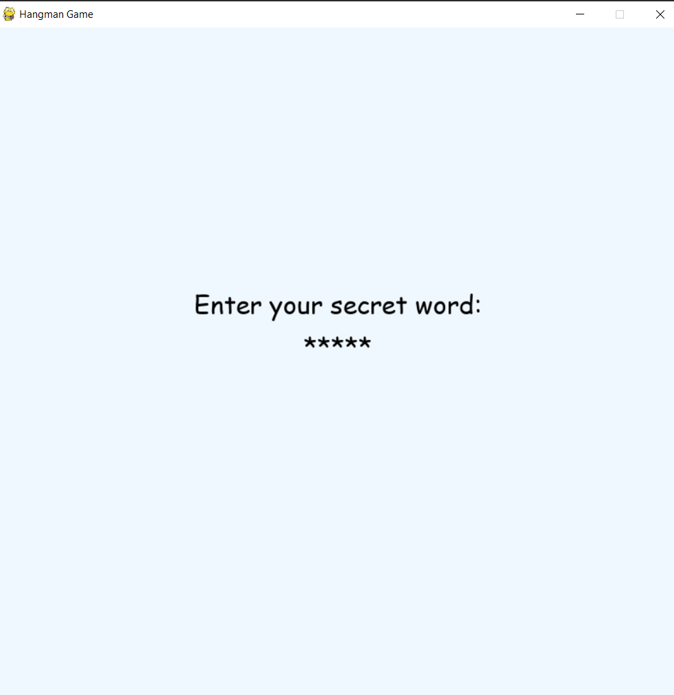
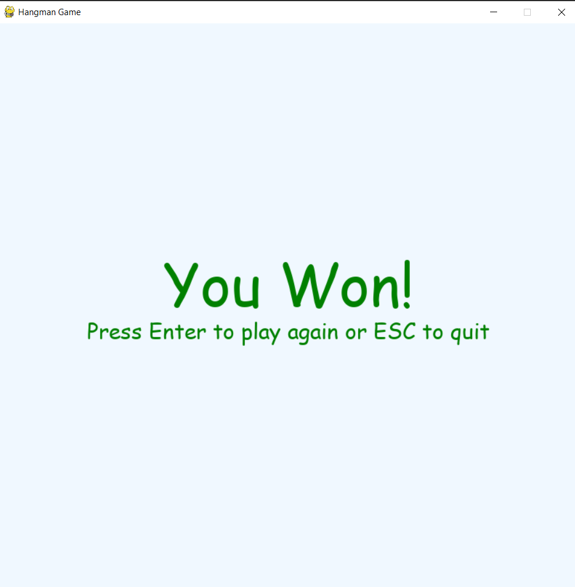

# 🕹️ Hangman Game 🎃

A spooky-themed Hangman game built using Python and Pygame. Play against random words or choose your own! 🌙

## 📸 Screenshots
Take a glimpse of the game in action:

- **Welcome Screen**  
  

- **Home Screen**  
  

- **Secret Word Screen**  
  

- **Win Game Screen**  
  

## 🚀 Features
- 🔀 **Custom or Random Word Selection**: Choose your own word or let the game surprise you.
- 🌌 **Eerie Themed Background**: Immerse yourself in a spooky atmosphere.
- 🎨 **Responsive UI**: Built with Pygame for a smooth and interactive experience.
- 🧠 **Easy to Customize and Expand**: Modify the game to suit your preferences.

## 🛠️ Tech Stack
- **Python 3.x**
- **Pygame**

## 💻 How to Run

Follow these steps to set up and run the game:

1. Clone the repository:
   ```bash
   git clone https://github.com/Rithik-Nair/Hangman.git
   cd Hangman
   ```

2. Install the required dependencies:
   ```bash
   pip install -r requirements.txt
   ```

3. Run the game:
   ```bash
   python main.py
   ```

## 📜 License
This project is licensed under the [MIT License](https://opensource.org/licenses/MIT).

---
Feel free to contribute, report issues, or suggest features to make this game even better! 🎉